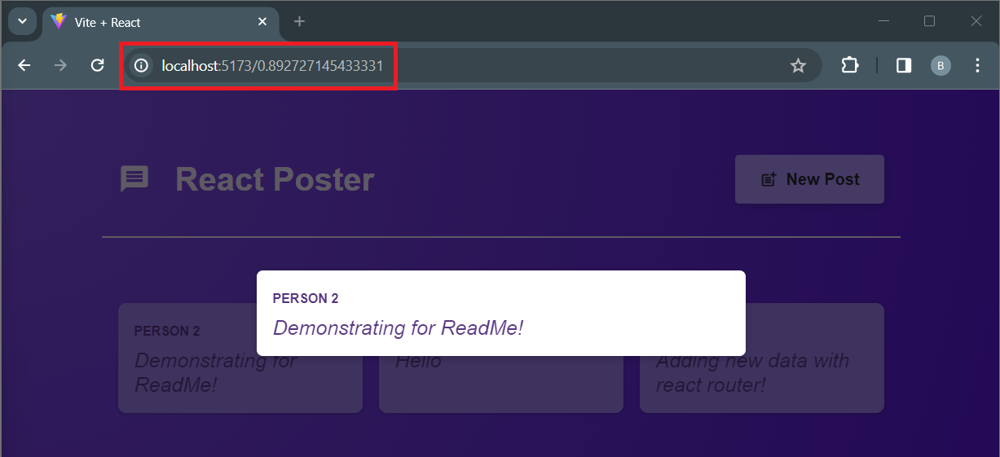

# React Form Submit

Simple form submit  single page application, utilizing state as much as possible.


## React Router

- Created list of route definition under main.jsx
- Making usage of loader and action eliminated the need for complex state management.
- Layout format where some components are visible for all paths.
- The nested routes allowed the separate URL with the modals displayed.



```jsx
const router = createBrowserRouter([
  // list of route definition
  { 
    path: '/', 
    element: <RootLayout />,
    children: [
      { 
        path: '/', 
        element: <Posts />,
        loader: postsLoader,
        children: [
          { 
            path: '/create-post', 
            element: <NewPost />,
            action: newPostAction
          },
          {
            path: '/:postId',
            element: <PostDetails />,
            loader: postDetailsLoader,
          }
        ]
      },
    ],
  },
]);

<RouterProvider router={router}/>
```

### REST API

Built a very simple backend for this project, under the repo named [react-submit-form-server](https://github.com/brianjsyang/react-form-submit-server).

Request data with the Fetch API within the loader or action function, which gets executed by the React Router

```jsx
export async function loader() {
  const response = await fetch('http://localhost:8080/posts');
  const resData = await response.json();

  return resData.posts;
}
```


# React + Vite

This template provides a minimal setup to get React working in Vite with HMR and some ESLint rules.

Currently, two official plugins are available:

- [@vitejs/plugin-react](https://github.com/vitejs/vite-plugin-react/blob/main/packages/plugin-react/README.md) uses [Babel](https://babeljs.io/) for Fast Refresh
- [@vitejs/plugin-react-swc](https://github.com/vitejs/vite-plugin-react-swc) uses [SWC](https://swc.rs/) for Fast Refresh
